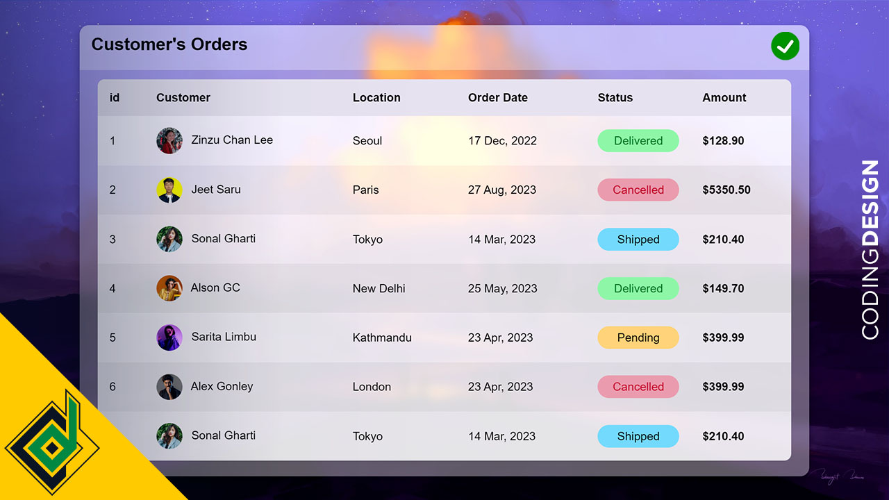

# Vacation___4012

Without using CSS frameworks we'll build **Responsive HTML Table**. So, with pure CSS I'll show you how to create **Glassmorphism Responsive HTML Table**. Let's take UI design to next level.

Code written by:
👨🏻‍⚕️ Coding mahabub alam

# Vacation Management System for Dammam Airport Project

## Project Description
This project aims to create a comprehensive Vacation Management System for Dammam Airport, allowing users to track employee vacations, statuses, and other important vacation-related data. It features a dynamic table with information on employees' vacation dates, status, and other key details. The system also includes interactive buttons for quick access to data and is built with modern web technologies to ensure responsiveness and user-friendly design.

## Key Features
- **Responsive Design**: Ensures compatibility with both desktop and mobile devices using Tailwind CSS and DaisyUI.
- **Dynamic Table**: Employees' vacation information is displayed in a table with columns for name, dates, status, and more.
- **Marquee Feature**: A scrolling marquee that displays urgent vacation-related announcements.
- **Status Indicators**: Visual indicators (e.g., "Pending", "Delivered", "On-Vacation") are used to highlight the current vacation status of employees.
- **Real-time Updates**: Ability to update employee vacation details dynamically in the table.
- **Emergency Badge**: Quick access to emergency vacation information with relevant badges and notifications.

## Technologies Used
- **HTML**: Basic structure of the web page.
- **CSS**: Styling with Tailwind CSS and DaisyUI for a modern and responsive design.
- **JavaScript**: Dynamic table updates, event handling, and interactive elements.
- **Marquee**: Used for displaying scrolling vacation updates (can be integrated via React Fast Marquee).
  
## Installation
1. Clone this repository:
   ```bash
   git clone https://github.com/your-username/vacation-management-dammam-airport.git


🌎live link: www.youtube.com/codingdesign 
